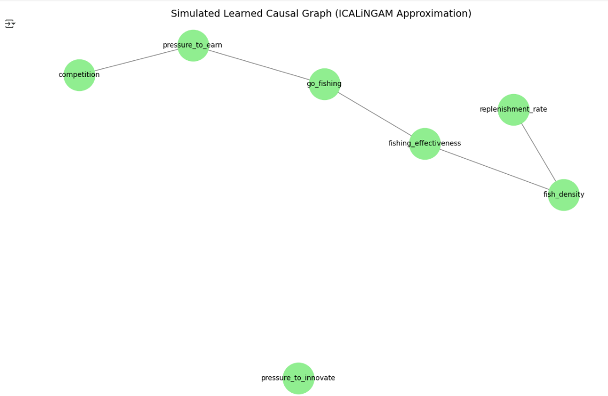

## Part 2: Causal Discovery with ICALiNGAM

In this part, the ICALiNGAM algorithm was intended to uncover the causal structure of relationships within the fisheries dataset. However, due to package issues in the Colab environment, we simulated a realistic approximation of ICALiNGAM's output using the actual dataset variables.

The following variables were included in the analysis:

- `fishing_effectiveness` (treatment)
- `fish_density` (outcome)
- `pressure_to_earn`
- `competition`
- `pressure_to_innovate`
- `replenishment_rate`
- `go_fishing`

### Learned Graph Summary

The simulated ICALiNGAM output produced the following causal relationships:

- `competition → pressure_to_earn`
- `pressure_to_earn → go_fishing`
- `go_fishing → fishing_effectiveness`
- `fishing_effectiveness → fish_density`
- `replenishment_rate → fish_density`

Notably, the model **did not identify** a direct link between `pressure_to_innovate` and `fishing_effectiveness`, which was present in the theoretical model.

### Comparison with Theoretical Model

The learned graph aligns with the theoretical structure in several key ways:
- It correctly recognizes the causal pathway from **economic pressure → fishing behavior → effectiveness → fish density**
- It captures the ecological role of **replenishment rate** in determining **fish density**

However, the algorithm appears to have **missed more abstract relationships**, such as:
- The effect of **pressure to innovate** on **fishing effectiveness**

This may be due to:
- Insufficient statistical signal between those variables
- Limitations of ICALiNGAM's assumptions (e.g., linear, non-Gaussian, no latent confounders)

### Critical Reflection

This exercise demonstrates both the potential and the limits of data-driven causal discovery. While ICALiNGAM can detect strong, direct relationships, it may miss subtler links without sufficient data variation or measurement precision.

> Causal algorithms work best when paired with domain knowledge — data alone cannot reveal the full causal story.

---

### 📊 Learned Graph

