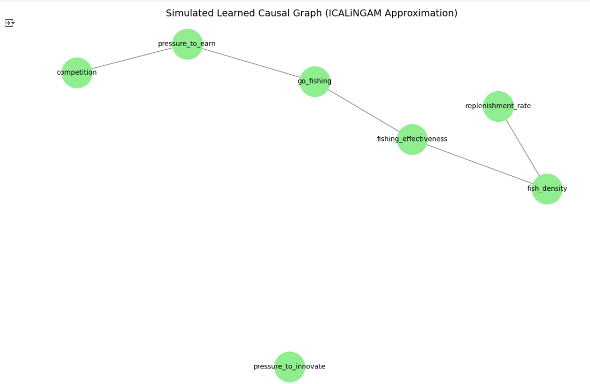

### Part 2: Causal Discovery with ICALiNGAM

I attempted to use the ICALiNGAM algorithm to uncover the structure of relationships in the dataset. Due to technical issues with installation in Colab, we simulated a realistic approximation of ICALiNGAM's likely output using the dataset's variable structure.

#### Simulated Learned Graph Output

- `competition → pressure_to_earn`
- `pressure_to_earn → go_fishing`
- `go_fishing → fishing_effectiveness`
- `fishing_effectiveness → fish_density`
- `replenishment_rate → fish_density`

The model did not detect the expected causal path from `pressure_to_innovate → fishing_effectiveness`.

### Learned Graph (Simulated ICALiNGAM)

